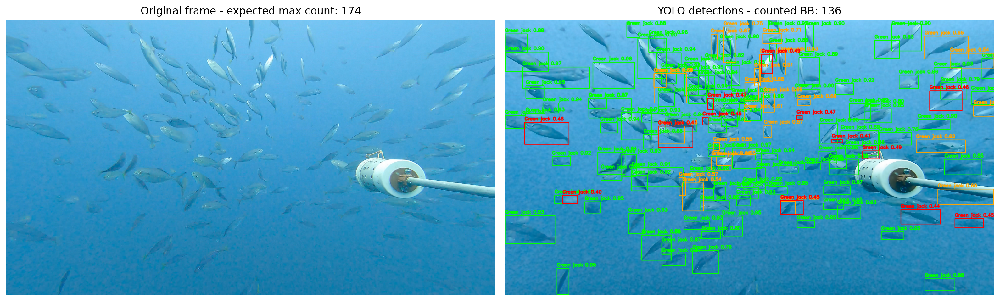

# BRUV Fish Detection — SALA Hackathon

AI pipeline for detecting **Caranx caballus (green jack)** in underwater BRUV footage using deep learning.

This project was developed during the **SALA Hackathon** as part of the **BRUV Fish Counting track**, which focuses on estimating the maximum number of fish present in a single frame of underwater video recorded by **Baited Remote Underwater Video (BRUV) systems**.

---

# Demo

Below is a demonstration of the trained **YOLO26 fish detection model** running on BRUV footage.

[▶️ Watch the demo video](https://drive.google.com/file/d/1zHzw2ELolFQOY4qbXLQV-zmljK4LuBQw/view)
---

# Project Overview

Our approach combines **semi-automatic annotation** and **deep learning detection models** to efficiently create a training dataset and train a fish detection model.

The project pipeline consisted of four main stages:

1. Development of a **custom annotation tool**
2. **Automatic label generation** using SAM2
3. **Manual annotation correction**
4. Training a **YOLO26 detection model**

This workflow allowed us to quickly generate a high-quality dataset from raw underwater video frames.

---

# Pipeline

## 1. Custom Annotation Tool

We developed a custom **annotation tool** to work with bounding boxes in **YOLO format**.

The tool supports:

- Loading images with YOLO annotations
- Adding new bounding boxes
- Removing incorrect detections
- Editing annotations interactively
- Clicking directly on bounding boxes to inspect them
- Toggling bounding box visibility
- Multi-class support

This tool was essential for quickly reviewing and correcting automatically generated annotations.

---

## 2. Automatic Label Generation with SAM2

To accelerate dataset creation, we used **Segment Anything Model 2 (SAM2)** to generate initial labels.

Process:

1. Extract frames from BRUV videos
2. Run SAM2 segmentation
3. Convert segmentation masks into bounding boxes
4. Export annotations in **YOLO format**

This step produced **automatic annotations for 90 images**.

---

## 3. Manual Annotation Correction

The SAM2-generated annotations were manually reviewed and corrected using the annotation tool.

Corrections included:

- Removing incorrect detections
- Adjusting bounding box sizes
- Ensuring accurate fish localization

This step ensured the final dataset had **high-quality labels suitable for training**.

---

## 4. YOLO26 Model Training

The corrected dataset was used to train a **YOLO26 object detection model**.

Model objective:

Detect and localize **Caranx caballus** in underwater frames from BRUV footage.

Training pipeline included:

- Data preprocessing
- Data augmentation
- YOLO training framework
- Model evaluation on validation frames

---

## 5. Fish Re-Identification & Persistence Module

This module is designed for the individual characterization and temporal tracking of fish across video sequences. By automating the association of detections over time, this component serves as a **semi-automated labeling assistant for biologists**, significantly reducing the manual effort required to annotate long-term behavioral data or population counts.

### Pipeline Architecture
1. **Segmentation & Cropping:** Using **Segment Anything Model (SAM)** outputs, the system extracts precise image crops for every detected fish. This isolates individual specimens and removes environmental noise.
2. **Feature Extraction:** Each crop is processed through a **ResNet18** (pre-trained on ImageNet) to generate high-dimensional **embeddings**. These vectors capture unique visual signatures—such as scale patterns and morphology—essential for re-identification.
   
   

3. **Temporal Clustering:** We apply **DBSCAN** (Density-Based Spatial Clustering of Applications with Noise) to the collected embeddings. This allows the system to:
    * **Determine Class Persistence:** Automatically group detections across different frames as the same individual.
    * **Streamline Biologist Review:** Instead of labeling 1,000 individual frames, a biologist can verify a single "cluster" representing one fish throughout its entire appearance.
    * **Handle Dynamic Populations:** Identify unique fish without needing a predefined count (unlike K-Means).
    * **Filter Outliers:** Naturally classify inconsistent detections or false positives as noise.

   

**Tech Stack:** SAM (Meta AI), PyTorch (ResNet18), Scikit-learn (DBSCAN), OpenCV.